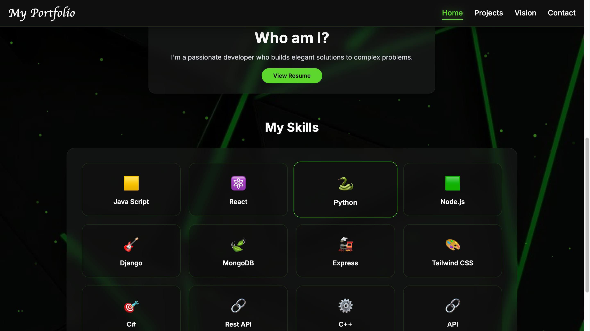
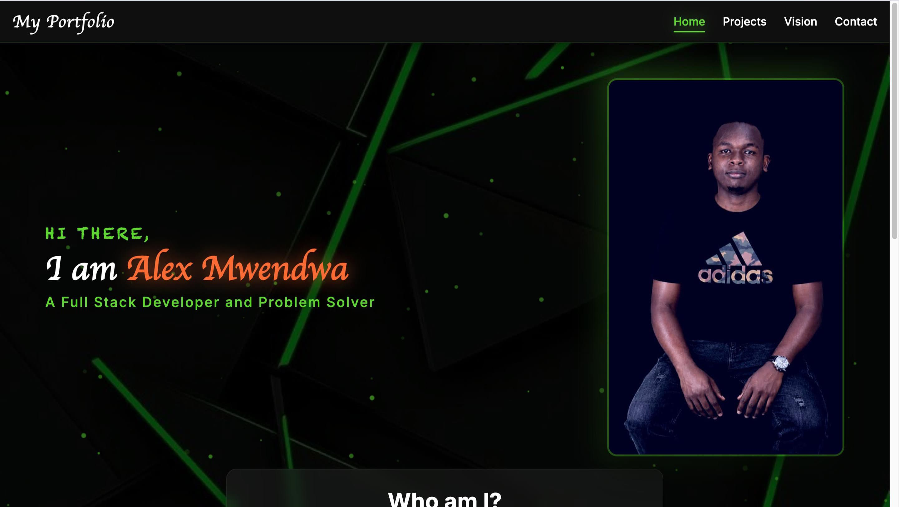
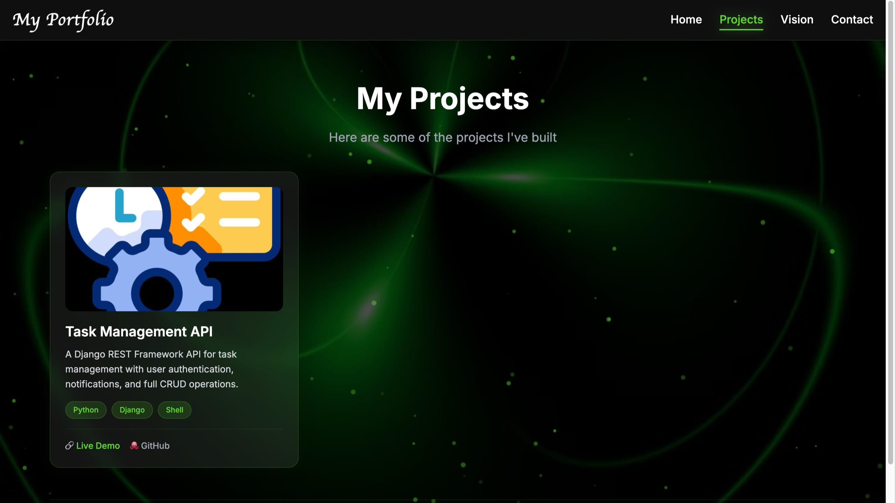
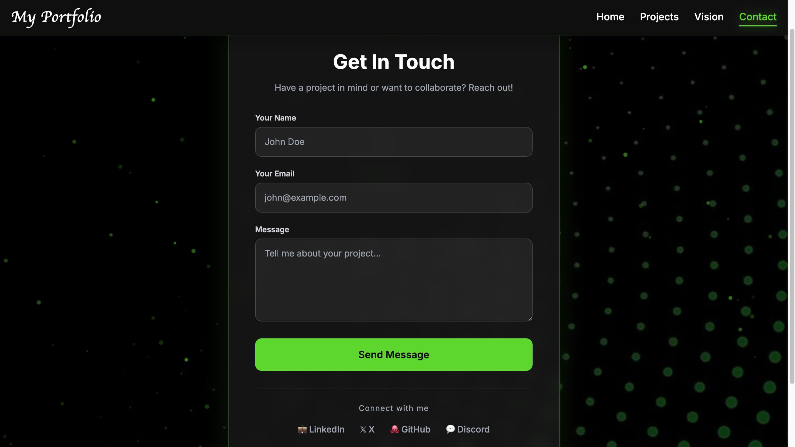

# 🚀 Alex Mwendwa — Full-Stack Developer Portfolio

A modern, fully responsive personal portfolio website built with React, Node.js, Express, and MongoDB. It features a dynamic admin dashboard, project management, contact form with email notifications, and a "Vision" page with star voting for current projects.

🔗 **Live Site:** [https://alexmwendwa.rweb.site](https://alexmwendwa.rweb.site)

---

## 📸 Screenshots

### Homepage



### Homepage (Hero Section)



### Projects Page



### Vision Page


### Contact Page



---

## ✨ Features

| Feature             | What It Does                                                        |
| :------------------ | :------------------------------------------------------------------ |
| **Home Page**       | Introduces you with your name, title, bio, skills, and image        |
| **Projects Page**   | Showcases your portfolio projects with live links and GitHub repos  |
| **Vision Page**     | Lists current projects (with star voting) and certificates          |
| **Contact Page**    | Allows visitors to send you messages that go directly to your email |
| **Admin Dashboard** | Lets you manage all content — projects, profile, messages, and more |
| **Authentication**  | Only you can access the Admin Dashboard                             |

---

## 🛠️ Tech Stack

┌──────────────────────────────────────────────────────────────┐
│ FRONTEND (React + Vite) │
│ ┌──────────┐ ┌──────────┐ ┌──────────┐ ┌──────────┐ │
│ │ Home │ │ Projects │ │ Vision │ │ Contact │ │
│ └────┬─────┘ └────┬─────┘ └────┬─────┘ └────┬─────┘ │
│ └─────────────┴─────────────┴─────────────┘ │
│ │ │
│ ┌──────▼──────┐ │
│ │ Axios │ (API Calls) │
│ └──────┬──────┘ │
└──────────────────────────┼─────────────────────────────────┘
│ HTTP / JSON
┌──────────────────────────▼─────────────────────────────────┐
│ BACKEND (Node.js + Express) │
│ ┌──────────────────────────────────────────────────────┐ │
│ │ Routes │ │
│ │ /api/profile /api/projects /api/contact /api/auth│ │
│ └──────────────────────────────────────────────────────┘ │
│ │ │
│ ┌──────────────────────────────────────────────────────┐ │
│ │ Controllers │ │
│ │ (Business Logic + Database Interaction) │ │
│ └──────────────────────────────────────────────────────┘ │
│ │ │
│ ┌──────────────────────────────────────────────────────┐ │
│ │ Models │ │
│ │ Profile Project ContactMessage CurrentProject │ │
│ │ Certificate │ │
│ └──────────────────────────────────────────────────────┘ │
└──────────────────────────┬─────────────────────────────────┘
│ Mongoose ODM
┌──────────────────────────▼─────────────────────────────────┐
│ DATABASE (MongoDB Atlas) │
│ ┌──────────────────────────────────────────────────────┐ │
│ │ Collections: profiles, projects, contactmessages, │ │
│ │ currentprojects, certificates │ │
│ └──────────────────────────────────────────────────────┘ │
└──────────────────────────────────────────────────────────────┘

text

---

## 📡 API Endpoints

┌─────────────────────────────────────────────────────────────────┐
│ API ENDPOINTS │
├─────────────────────────────────────────────────────────────────┤
│ │
│ GET /api/profile → Get your profile data │
│ PUT /api/profile → Update your profile (protected)│
│ │
│ GET /api/projects → Get all projects │
│ POST /api/projects → Add a project (protected) │
│ DELETE /api/projects/:id → Delete project (protected) │
│ │
│ POST /api/contact → Send a contact message │
│ GET /api/contact → Get messages (protected) │
│ DELETE /api/contact/:id → Delete message (protected) │
│ │
│ GET /api/current-projects → Get current projects │
│ POST /api/current-projects → Add current project (protected)│
│ DELETE /api/current-projects/:id → Delete (protected) │
│ PUT /api/current-projects/:id/star → Add a star │
│ │
│ GET /api/certificates → Get certificates │
│ POST /api/certificates → Add certificate (protected) │
│ DELETE /api/certificates/:id → Delete certificate (protected) │
│ │
│ POST /api/admin/login → Admin login │
└─────────────────────────────────────────────────────────────────┘

---

## 🛡️ Authentication Flow

┌─────────────┐ ┌─────────────┐
│ Browser │ │ Server │
│ (Frontend) │ │ (Backend) │
└──────┬──────┘ └──────┬──────┘
│ │
│ 1. POST /api/admin/login │
│ (email + password) │
│ ─────────────────────────▶ │
│ │
│ 2. Validate credentials │
│ 3. Generate JWT Token │
│ │
│ 4. Returns JWT Token │
│ ◀───────────────────────── │
│ │
│ 5. Store Token in │
│ localStorage │
│ │
│ 6. Request with │
│ Authorization: Bearer │
│ <token> │
│ ─────────────────────────▶ │
│ │
│ 7. Verify Token │
│ 8. Allow/Deny Access │
│ │
│ 9. Response │
│ ◀───────────────────────── │
└────────────────────────────┘

---

## 📂 Project Structure

src/
├── components/ # Reusable UI components
│ ├── Layout.jsx
│ ├── Navbar.jsx
│ ├── LoadingSpinner.jsx
│ └── Sparkles.jsx
├── pages/ # Full pages
│ ├── Home.jsx
│ ├── Projects.jsx
│ ├── Vision.jsx
│ ├── Contact.jsx
│ ├── AdminLogin.jsx
│ └── AdminDashboard.jsx
├── services/ # API calls (Axios)
│ └── api.js
├── hooks/ # Custom React hooks
├── utils/ # Helper functions
│ └── skillIcons.js
├── App.jsx # Main app with routing
└── main.jsx # Entry point

---

## 🛠️ Admin Dashboard

┌─────────────────────────────────────────────────────────────────┐
│ ADMIN DASHBOARD │
├─────────────────────────────────────────────────────────────────┤
│ │
│ ┌───────────────────────────────────────────────────────────┐ │
│ │ ✏️ EDIT PROFILE │ │
│ │ Name: [Alex Mwendwa] Title: [Full Stack Developer] │ │
│ │ Bio: [I'm a passionate...] About: [Longer description] │ │
│ │ Skills: [JavaScript, React, Python, ...] │ │
│ │ Avatar: [URL] Resume: [URL] │ │
│ │ Social: [GitHub, LinkedIn, Twitter, Discord] │ │
│ │ [Update Profile] │ │
│ └───────────────────────────────────────────────────────────┘ │
│ │
│ ┌───────────────────────────────────────────────────────────┐ │
│ │ 📦 ADD PROJECT │ │
│ │ Title: [E-Commerce API] │ │
│ │ Description: [Built a...] │ │
│ │ Tech Stack: [Node.js, Redis, Docker] │ │
│ │ Image URL: [https://i.imgur.com/...] │ │
│ │ Live URL: [https://api.example.com] │ │
│ │ Repo URL: [https://github.com/...] │ │
│ │ [Add Project] │ │
│ └───────────────────────────────────────────────────────────┘ │
│ │
│ ┌───────────────────────────────────────────────────────────┐ │
│ │ 📂 MANAGE PROJECTS (3) │ │
│ │ ┌──────────────────────────────────────────────────┐ │ │
│ │ │ E-Commerce API | Node.js, Redis, Docker |🗑️│ │ │
│ │ │ Task Management | Python, Django, Shell |🗑️│ │ │
│ │ │ AI Chatbot | Python, TensorFlow |🗑️│ │ │
│ │ └──────────────────────────────────────────────────┘ │ │
│ └───────────────────────────────────────────────────────────┘ │
│ │
│ ┌───────────────────────────────────────────────────────────┐ │
│ │ ✉️ CONTACT MESSAGES (2) │ │
│ │ ┌──────────────────────────────────────────────────┐ │ │
│ │ │ John (john@email.com): "Hello, I need..." |🗑️│ │ │
│ │ │ Jane (jane@email.com): "Hi, can you..." |🗑️│ │ │
│ │ └──────────────────────────────────────────────────┘ │ │
│ └───────────────────────────────────────────────────────────┘ │
│ │
│ ┌───────────────────────────────────────────────────────────┐ │
│ │ 🚀 CURRENT PROJECTS (Vision) │ │
│ │ Title: [DocuMint] Description: [An automated...] │ │
│ │ Status: [In Progress] Repo URL: [https://...] │ │
│ │ [Add Current Project] │ │
│ └───────────────────────────────────────────────────────────┘ │
│ │
│ ┌───────────────────────────────────────────────────────────┐ │
│ │ 🏆 CERTIFICATES │ │
│ │ Title: [Back-End Web Development] │ │
│ │ Issuer: [ALX Africa] Date: [18/09/2025] │ │
│ │ Category: [Certification] Image URL: [https://...] │ │
│ │ Verify URL: [https://savanna.alxafrica.com/...] │ │
│ │ [Add Certificate] │ │
│ └───────────────────────────────────────────────────────────┘ │
│ │
│ [Logout] │
└─────────────────────────────────────────────────────────────────┘

### 🔐 Admin Dashboard — Remember Me & Full Edit

- **Remember Me:** Stay logged in across browser sessions with a simple checkbox.
- **Edit Projects:** Update your portfolio projects without deleting and re-adding them.
- **Edit Current Projects:** Modify your Vision page projects on the fly.
- **Edit Certificates:** Update certificate details, verify URLs, and categories instantly.

No deleting and re-adding — everything is fully editable!

---

## 🚀 Deployment

### 📦 Backend (Render)

┌─────────────────────┐
│ RENDER │
│ (Cloud Application │
│ Platform) │
│ │
│ Hosts your Node.js/ │
│ Express API server │
│ at onrender.com │
└─────────────────────┘

### 🌐 Frontend (Vercel)

┌─────────────────────┐
│ VERCEL │
│ (Frontend Cloud) │
│ │
│ Hosts your React │
│ portfolio site │
│ at vercel.app │
└─────────────────────┘

### 🗄️ Database (MongoDB Atlas)

┌─────────────────────┐
│ MONGODB ATLAS │
│ (Cloud Database) │
│ │
│ Hosts your data │
│ Always online │
└─────────────────────┘

### 🔄 The Full Picture

┌─────────────────────────────────────────────────────────────────────┐
│ YOUR DEPLOYMENT SETUP │
├─────────────────────────────────────────────────────────────────────┤
│ │
│ ┌─────────────────────┐ ┌─────────────────────────────┐ │
│ │ VERCEL │ │ RENDER │ │
│ │ (Frontend Cloud) │ │ (Cloud Application │ │
│ │ │ │ Platform) │ │
│ │ Hosts your React │ │ │ │
│ │ portfolio site │ │ Hosts your Node.js/Express│ │
│ │ at │ │ API server at │ │
│ │ vercel.app │ │ onrender.com │ │
│ └──────────┬───────────┘ └──────────────┬──────────────┘ │
│ │ │ │
│ │ ┌─────────────────────────────┐ │ │
│ └─────▶│ MONGODB ATLAS │◀┘ │
│ │ (Cloud Database) │ │
│ │ Hosts your data │ │
│ └─────────────────────────────┘ │
└─────────────────────────────────────────────────────────────────────┘

---

## 🚀 Running Locally

### Frontend

```bash
cd my_portfolio_frontend
npm install
npm run dev
# Visit http://localhost:5173
Backend
bash
cd my_portfolio_backend
npm install
npm run dev
# API runs on http://localhost:5001
Environment Variables
Frontend (.env):

env
VITE_API_URL=http://localhost:5001/api
Backend (.env):

env
PORT=5001
MONGO_URI=mongodb+srv://...
JWT_SECRET=your_secret
ADMIN_EMAIL=your_email@gmail.com
ADMIN_PASSWORD=your_password
RESEND_API_KEY=re_...
RESEND_SENDER_EMAIL=onboarding@resend.dev
RECIPIENT_EMAIL=your_email@gmail.com
📌 Final URLs
Link	URL
Live Portfolio	https://alexmwendwa.rweb.site
Admin Dashboard	https://alexmwendwa.rweb.site/admin
Backend API	https://my-portfolio-backend-k2ym.onrender.com
GitHub (Frontend)	https://github.com/Alexinthehub/my_portfolio_frontend
GitHub (Backend)	https://github.com/Alexinthehub/my_portfolio_backend
🎯 Your Tech Stack

┌──────────────────────────────────────────────────────────────┐
│                    YOUR TECH STACK                          │
├──────────────────────────────────────────────────────────────┤
│                                                              │
│  🎨 Frontend:    React (Vite)                               │
│  🔗 API Layer:   Axios                                      │
│  🖥️ Backend:     Node.js + Express.js                       │
│  🗄️ Database:    MongoDB Atlas (Cloud)                      │
│  🔐 Auth:        JWT (JSON Web Tokens)                      │
│  ☁️ Hosting:     Vercel (Frontend) + Render (Backend)       │
│  📦 Version Control: GitHub                                 │
│                                                              │
└──────────────────────────────────────────────────────────────┘
📝 License
This project is open source and available under the MIT License.

Built with ❤️ by Alex Mwendwa
```
